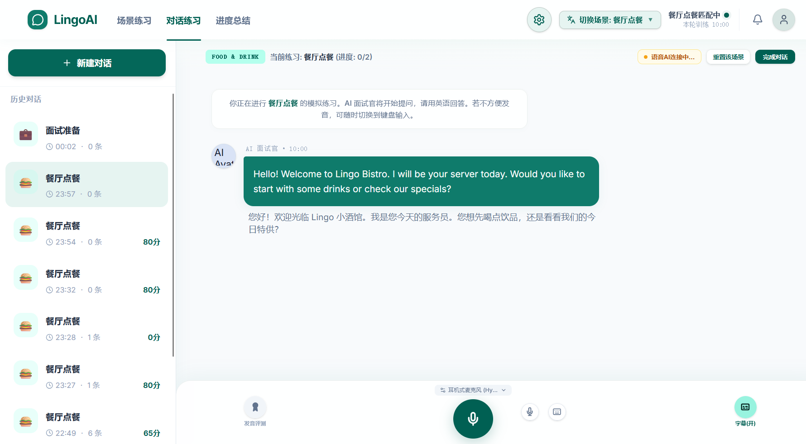
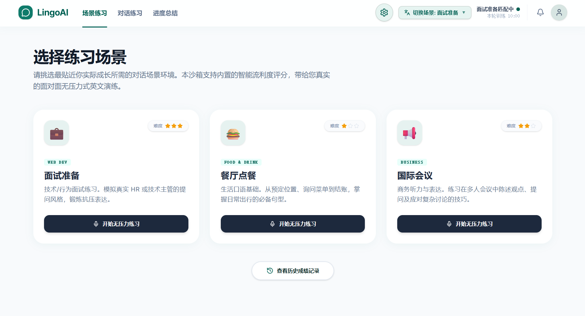
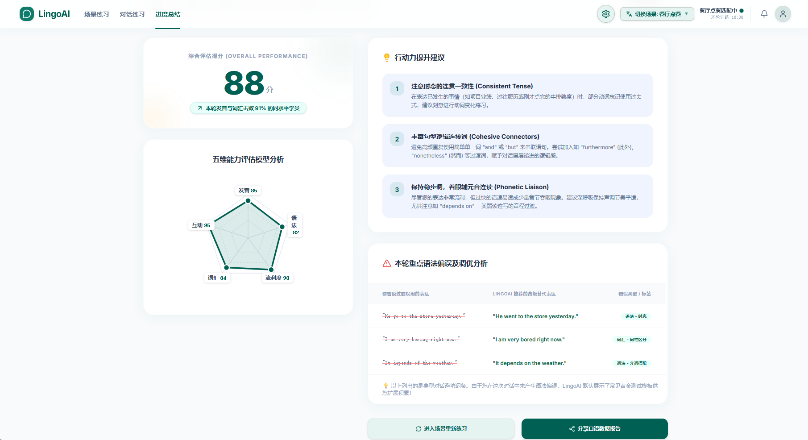
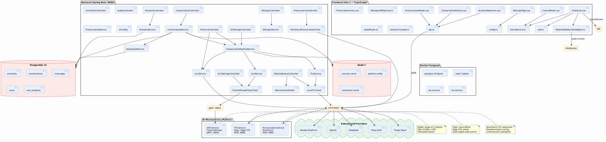

# VocaLogue-Lingoai

**AI 驱动的英语口语陪练平台** — 通过真实场景对话、实时语音识别、发音评测与 AI 智能反馈，帮助用户高效提升英语口语能力。

[](https://spring.io/projects/spring-boot)
[](https://vuejs.org/)
[](https://www.postgresql.org/)
[](LICENSE)

> 🎬 **Demo 演示**: [VocaLogue-Lingoai 演示 demo（基于 ASR+LLM+TTS 管道 + 端到端云端大模型实现）](https://www.bilibili.com/video/BV1mcEh6mEu8/?share_source=copy_web&vd_source=d3b20fbc9cf74d8cbbabaf9c21ec7e43)

---

## 项目概述

VocaLogue-Lingoai 是一个全栈 AI 英语口语练习应用，提供沉浸式情景对话练习。用户可以选择不同的练习场景（如技术面试、餐厅点餐、商务会议等），与 AI 进行实时语音或文字对话，并获得发音评分、语法纠错和多维度能力评估。

### 核心功能

- **🎯 情景对话练习** — 提供技术面试、餐厅点餐、商务会议等多种真实场景，每个场景包含定制化 AI 角色和对话流程
- **🎙️ 语音对话模式** — 支持实时语音识别 + AI 对话 + 语音合成全流程管线（ASR → LLM → TTS）
- **📝 文字输入模式** — 适合不适合语音的场景，通过键盘输入与 AI 交流
- **🔊 双引擎 TTS** — 支持 Piper TTS（本地离线）和 Edge TTS（免费在线）两种语音合成引擎
- **📊 发音评测** — 基于 Wav2Vec2 + phonemizer 的音素级发音评分，支持准确度、流利度、完整度三维度评估
- **🤖 多 LLM 引擎** — 支持 OpenAI、DeepSeek、智谱 GLM、通义千问、豆包等多种大语言模型
- **📈 练习总结** — 对话结束后自动生成包含发音、语法、流利度、词汇、互动性五维能力的详细评估报告
- **📋 对话历史** — 保存所有练习记录，支持回看历史对话和评分
- **🔄 语音打断** — 支持 VAD 语音活动检测，AI 说话时可打断并重新对话

### 界面预览


*AI 实时语音对话练习*


*多种练习场景选择*


*发音评分与多维度能力评估*

---

## 技术栈

### 前端 (Frontend)

| 技术 | 版本 | 说明 |
|------|------|------|
| [Vue 3](https://vuejs.org/) | ^3.5.13 | 渐进式 JavaScript 框架 (Composition API + `<script setup>`) |
| [TypeScript](https://www.typescriptlang.org/) | ~5.8.3 | 类型安全的 JavaScript 超集 |
| [Vite](https://vitejs.dev/) | ^6.3.5 | 下一代前端构建工具 |
| [Tailwind CSS](https://tailwindcss.com/) | ^4.3.0 | Utility-first CSS 框架 |
| [lucide-vue-next](https://lucide.dev/) | ^1.0.0 | 开源图标库 |
| [Vue TSC](https://github.com/vuejs/language-tools) | ^2.2.8 | Vue 类型检查工具 |

### 后端 (Backend)

| 技术 | 版本 | 说明 |
|------|------|------|
| [Spring Boot](https://spring.io/projects/spring-boot) | 3.2.5 | 微服务开发框架 |
| [Java](https://www.java.com/) | 21 | 编程语言 |
| [Spring Data JPA](https://spring.io/projects/spring-data-jpa) | - | 持久层框架 |
| [Spring Data Redis](https://spring.io/projects/spring-data-redis) | - | Redis 缓存集成 |
| [Spring WebSocket](https://spring.io/guides/gs/messaging-stomp-websocket/) | - | WebSocket 支持 |
| [PostgreSQL](https://www.postgresql.org/) | 15 | 关系型数据库 |
| [Redis](https://redis.io/) | 7 | 内存缓存数据库 |
| [OkHttp](https://square.github.io/okhttp/) | 4.12.0 | HTTP 客户端（SSE/流式通信） |
| [gRPC](https://grpc.io/) | 1.64.0 | 高性能 RPC 框架 |
| [Protobuf](https://protobuf.dev/) | 3.25.3 | 结构化数据序列化 |
| [Maven](https://maven.apache.org/) | - | 项目构建管理 |

### AI 服务 (Python 微服务)

#### ASR (语音识别) 服务

| 技术 | 说明 |
|------|------|
| [FastAPI](https://fastapi.tiangolo.com/) | 高性能 Python Web 框架 |
| [faster-whisper](https://github.com/SYSTRAN/faster-whisper) | 基于 CTranslate2 的 Whisper 语音识别（large-v2 模型） |
| [gRPC (Python)](https://grpc.io/docs/languages/python/) | 与后端通信使用 |
| [WebRTC VAD](https://github.com/wiseman/py-webrtcvad) | 语音活动检测 |

#### TTS (语音合成) 服务

| 技术 | 说明 |
|------|------|
| [FastAPI](https://fastapi.tiangolo.com/) | Web 框架 |
| [Piper TTS](https://github.com/rhasspy/piper) | 本地离线神经网络 TTS |
| [Edge TTS](https://github.com/rany2/edge-tts) | 微软 Edge 免费在线 TTS |

#### Pronunciation (发音评测) 服务

| 技术 | 说明 |
|------|------|
| [FastAPI](https://fastapi.tiangolo.com/) | Web 框架 |
| [Wav2Vec2](https://huggingface.co/facebook/wav2vec2-base-960h) | Facebook 语音识别模型（CTC 强制对齐） |
| [Transformers](https://huggingface.co/docs/transformers/index) | HuggingFace 模型库 |
| [Phonemizer](https://github.com/bootphon/phonemizer) | 文本转音素（espeak 后端） |
| [PyTorch](https://pytorch.org/) | 深度学习框架 |
| [TorchAudio](https://pytorch.org/audio/) | 音频处理工具 |

### 容器化与部署

| 技术 | 说明 |
|------|------|
| [Docker](https://www.docker.com/) | 容器化部署 |
| [Docker Compose](https://docs.docker.com/compose/) | 多服务编排 |

---

## 系统架构


*系统架构图 — 展示前端、后端与 AI 微服务之间的通信关系*

### 架构说明

```
┌─────────────────────────────────────────────────────────────────────┐
│                           Frontend (Vue 3 + TS)                       │
│  ┌──────────┐  ┌──────────┐  ┌──────────┐  ┌────────────────────┐  │
│  │ Chat UI  │  │ Scenario │  │ Settings │  │ History/Analysis   │  │
│  └────┬─────┘  └──────────┘  └──────────┘  └────────────────────┘  │
│       │                                                              │
│  ┌────▼────────────────────────────────────────────────────────┐    │
│  │              VoiceService / PipelineWebSocketAdapter         │    │
│  └────┬──────────────────────┬───────────────────────┬─────────┘    │
└───────┼──────────────────────┼───────────────────────┼──────────────┘
        │ HTTP/WS              │ WebSocket             │ HTTP/REST
        ▼                      ▼                       ▼
┌───────────────┐   ┌───────────────────┐   ┌──────────────────────┐
│  Spring Boot  │   │  Pipeline WS     │   │  Python 微服务       │
│   Backend     │   │  (ASR→LLM→TTS)   │   │                      │
│               │   │                   │   │  ┌────────────────┐ │
│  ┌─────────┐  │   │                   │   │  │  ASR Service   │ │
│  │  LLM    │◄─┤   │                   │   │  │ (faster-whisper)│ │
│  │ Proxy   │  │   │                   │   │  │   gRPC:50051   │ │
│  ├─────────┤  │   │                   │   │  └────────────────┘ │
│  │ TTS     │◄─┤   │                   │   │  ┌────────────────┐ │
│  │ Proxy   │  │   │                   │   │  │  TTS Service   │ │
│  ├─────────┤  │   │                   │   │  │ (Piper/Edge)   │ │
│  │ Session │  │   │                   │   │  │   REST:8000    │ │
│  │ Manager │  │   │                   │   │  └────────────────┘ │
│  ├─────────┤  │   │                   │   │  ┌────────────────┐ │
│  │ Evalua- │  │   │                   │   │  │ Pronunciation │ │
│  │ tion    │  │   │                   │   │  │ (wav2vec2)    │ │
│  └────┬────┘  │   │                   │   │  │   REST:8002   │ │
│       │       │   │                   │   │  └────────────────┘ │
│  ┌────▼────┐  │   └───────────────────┘   └──────────────────────┘
│  │Postgres │  │
│  │  Redis  │  │
│  └─────────┘  │
└───────────────┘
```

### 数据流

1. **管线模式 (Pipeline):** 用户语音 → WebSocket 流式音频 → ASR 服务 (faster-whisper) → LLM 推理 → TTS 合成 → 音频返回前端
2. **实时模式 (Realtime):** 前端 VAD 检测 → 音频采集 → 流式 ASR → LLM 推理 → TTS 合成 → 实时对话
3. **文本模式 (Typing):** 用户输入文字 → REST API → LLM 推理 → 返回文本回复

---

## 快速开始

### 前置要求

- [Docker](https://www.docker.com/) & [Docker Compose](https://docs.docker.com/compose/)
- [Node.js](https://nodejs.org/) >= 18
- [Java](https://www.java.com/) 21+ & [Maven](https://maven.apache.org/)
- [Python](https://www.python.org/) 3.10+

### 1. 启动基础设施（数据库 + AI 微服务）

```bash
docker-compose up -d
```

这会启动以下服务：
- PostgreSQL 15 (端口 5432)
- Redis 7 (端口 6379)
- ASR 服务 - faster-whisper (gRPC 端口 50051)
- TTS 服务 - Piper + Edge TTS (REST 端口 8000)

### 2. 启动后端

```bash
cd backend
mvn clean install -DskipTests
mvn spring-boot:run
```

后端服务运行在 `http://localhost:8080`

### 3. 启动前端

```bash
cd frontend
npm install
npm run dev
```

前端开发服务器运行在 `http://localhost:5173`

---

## 环境变量配置

### 后端 (application.yml)

| 变量 | 说明 | 默认值 |
|------|------|--------|
| `OPENAI_API_KEY` | OpenAI API 密钥 | - |
| `DEEPSEEK_API_KEY` | DeepSeek API 密钥 | - |
| `GLM_API_KEY` | 智谱 GLM API 密钥 | - |
| `QIANWEN_API_KEY` | 通义千问 API 密钥 | - |
| `DOUBAO_API_KEY` | 豆包 API 密钥 | - |
| `ASR_GRPC_HOST` | ASR gRPC 服务地址 | localhost |
| `ASR_GRPC_PORT` | ASR gRPC 服务端口 | 50051 |
| `ASR_DEVICE` | ASR 运行设备 (cpu/cuda) | cuda |
| `TTS_SERVICE_URL` | TTS 服务地址 | http://localhost:8001 |
| `AZURE_SPEECH_KEY` | Azure 语音密钥 | - |
| `AZURE_SPEECH_REGION` | Azure 语音区域 | eastasia |

### 前端 (.env)

| 变量 | 说明 | 默认值 |
|------|------|--------|
| `VITE_API_BASE_URL` | 后端 API 地址 | http://localhost:8080 |

---

## 项目结构

```
VocaLogue/
├── frontend/                     # Vue 3 前端
│   ├── src/
│   │   ├── components/           # Vue 组件
│   │   │   ├── ChatArea.vue      # 对话区
│   │   │   ├── ControlPanel.vue  # 控制面板
│   │   │   ├── Header.vue        # 顶部导航
│   │   │   ├── ScenarioSelection.vue  # 场景选择
│   │   │   ├── PronunciationModal.vue # 发音评测弹窗
│   │   │   ├── PracticeSummary.vue    # 练习总结
│   │   │   ├── SettingsPage.vue       # 设置页
│   │   │   ├── ConversationHistory.vue # 对话历史
│   │   │   └── PracticeModeModal.vue   # 模式选择
│   │   ├── services/
│   │   │   ├── asr/              # ASR 服务
│   │   │   │   ├── WhisperASRService.ts
│   │   │   │   └── index.ts
│   │   │   └── voice/            # 语音服务
│   │   │       ├── IVoiceService.ts
│   │   │       ├── VoiceService.ts
│   │   │       ├── VoiceServiceFactory.ts
│   │   │       ├── adapters/
│   │   │       │   ├── DoubaoVoiceServiceAdapter.ts
│   │   │       │   ├── OpenAIVoiceServiceAdapter.ts
│   │   │       │   └── PipelineWebSocketAdapter.ts
│   │   │       └── index.ts
│   │   ├── utils/
│   │   │   ├── browserCompat.ts  # 浏览器兼容性检测
│   │   │   └── vad.ts            # VAD 语音活动检测
│   │   ├── config.ts             # 配置服务
│   │   ├── api.ts                # API 客户端
│   │   ├── types.ts              # TypeScript 类型定义
│   │   ├── scenariosData.ts      # 场景数据
│   │   ├── audioPlayer.ts        # 音频播放器
│   │   ├── App.vue               # 根组件
│   │   └── main.ts               # 入口文件
│   ├── package.json
│   └── vite.config.ts
├── backend/                      # Spring Boot 后端
│   ├── src/main/
│   │   ├── java/com/lingoai/    # Java 源代码
│   │   └── resources/
│   │       └── application.yml   # 配置文件
│   └── pom.xml
├── asr-service/                  # ASR 微服务 (Python)
│   ├── app/
│   │   ├── proto/               # gRPC protobuf 定义
│   │   ├── server.py            # gRPC 服务器
│   │   ├── engine.py            # faster-whisper 引擎
│   │   └── stream_processor.py  # 流式处理
│   ├── requirements.txt
│   └── Dockerfile
├── tts-service/                  # TTS 微服务 (Python)
│   ├── app/
│   │   ├── server.py            # FastAPI 服务器
│   │   ├── piper_engine.py      # Piper TTS 引擎
│   │   ├── edge_engine.py       # Edge TTS 引擎
│   │   └── voices.py            # 语音列表
│   ├── models/piper/            # Piper 语音模型
│   ├── requirements.txt
│   └── Dockerfile
├── pronunciation-service/        # 发音评测微服务 (Python)
│   ├── app/
│   │   ├── main.py              # FastAPI 服务器
│   │   └── phoneme_scorer.py    # 音素评分引擎
│   ├── requirements.txt
│   └── Dockerfile
├── piper/                        # Piper TTS 离线语音数据
│   └── espeak-ng-data/          # espeak 发音数据
├── md/                            # 项目文档
│   ├── 后端设计说明.md             # 后端架构设计文档
│   ├── 后端API接口文档.md          # 后端 REST API 详细文档
│   ├── 管道实现文档.md             # ASR→LLM→TTS 管道实现文档
│   ├── 基础管道方法实现实时对话设计方案.txt  # 管道式实时对话打断设计方案
│   ├── 功能设计细节               # 端到端语音大模型功能设计补充
│   ├── GPU加速实现文档.md          # Faster-Whisper GPU 加速实现文档
│   ├── deepseekapi规范            # DeepSeek LLM 接入配置自查规范
│   ├── 豆包端到端实时语音大模型API接入文档  # 豆包 Realtime API 接入文档
│   └── 草稿指令.txt               # 开发草稿与命令记录
├── screenshots/                  # 界面截图与架构图文件夹
│   ├── chat-preview.png          # 对话练习界面截图
│   ├── scenario-preview.png      # 场景选择界面截图
│   ├── summary-preview.png       # 发音评测与总结截图
│   └── architecture.png          # 系统架构图
├── docker-compose.yml            # Docker 编排配置
├── docker-compose.gpu.yml        # GPU 加速版编排
└── init_data.sql                 # 初始化数据
```

---

## 场景与练习

目前内置了三个练习场景，每个场景包含多轮引导式对话：

| 场景 | 场景 ID | 说明 |
|------|---------|------|
| 💻 | `frontend` | **前端技术面试** — 模拟 React/TypeScript/性能优化等技术面试问答 |
| 🍽️ | `restaurant` | **餐厅点餐** — 模拟西餐厅点餐对话，训练餐饮场景口语 |
| 📊 | `conference` | **商务会议** — 模拟产品复盘/路线图讨论等商务场景 |

---

## 第三方框架与致谢

本项目基于以下优秀的开源项目和框架构建：

### 前端框架
- **[Vue 3](https://vuejs.org/)** — MIT 协议，前端 UI 框架
- **[Vite](https://vitejs.dev/)** — MIT 协议，前端构建工具
- **[Tailwind CSS](https://tailwindcss.com/)** — MIT 协议，CSS 框架
- **[TypeScript](https://www.typescriptlang.org/)** — Apache 2.0 协议
- **[lucide-vue-next](https://lucide.dev/)** — ISC 协议，开源图标库

### 后端框架
- **[Spring Boot](https://spring.io/projects/spring-boot)** — Apache 2.0 协议
- **[Spring Data JPA](https://spring.io/projects/spring-data-jpa)** — Apache 2.0 协议
- **[OkHttp](https://square.github.io/okhttp/)** — Apache 2.0 协议
- **[gRPC](https://grpc.io/)** — Apache 2.0 协议
- **[Protobuf](https://protobuf.dev/)** — Apache 2.0 协议

### AI 与语音技术
- **[faster-whisper](https://github.com/SYSTRAN/faster-whisper)** — MIT 协议，基于 CTranslate2 的 Whisper 语音识别
- **[Piper TTS](https://github.com/rhasspy/piper)** — MIT 协议，本地神经网络 TTS
- **[Edge TTS](https://github.com/rany2/edge-tts)** — GPL 3.0 协议，微软 Edge TTS Python 封装
- **[Wav2Vec2](https://huggingface.co/facebook/wav2vec2-base-960h)** — MIT 协议，Facebook 语音模型
- **[HuggingFace Transformers](https://huggingface.co/docs/transformers)** — Apache 2.0 协议
- **[Phonemizer](https://github.com/bootphon/phonemizer)** — GPL 3.0 协议，文本转音素
- **[PyTorch](https://pytorch.org/)** — BSD 协议，深度学习框架
- **[TorchAudio](https://pytorch.org/audio/)** — BSD 协议，音频处理工具
- **[WebRTC VAD](https://github.com/wiseman/py-webrtcvad)** — BSD 协议，语音活动检测

### 数据存储
- **[PostgreSQL](https://www.postgresql.org/)** — PostgreSQL 协议，关系型数据库
- **[Redis](https://redis.io/)** — BSD 3-Clause 协议，内存缓存

### 容器化
- **[Docker](https://www.docker.com/)** — Apache 2.0 协议
- **[Docker Compose](https://docs.docker.com/compose/)** — Apache 2.0 协议

### 特别感谢
- **[Echoic](https://github.com/your-echoic-repo)** — 发音评测逻辑参考来源
- **[everyone-can-use-english](https://github.com/your-repo)** — ASR→LLM→TTS 管线设计参考

---

## License

[MIT](LICENSE)
